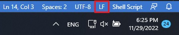

# YtSpamScanner

## General Information
Task: Text Analytics project
Team Members:  Angelina Basova, Abdulghani Almasri, Paul Dietze, Vivian Kazakova
Mail Addresses: angelina.basova@stud.uni-heidelberg.de,  abdulghani.almasri@stud.uni-heidelberg.de, cl250@uni-heidelberg.de, vivian.kazakova@stud.uni-heidelberg.de
Existing Code Fragments: sklearn models ([SVM](https://scikit-learn.org/stable/modules/generated/sklearn.svm.SVC.html), [Logistic Regression](https://scikit-learn.org/stable/modules/generated/sklearn.linear_model.LogisticRegression.html), [Naive Bayes](https://scikit-learn.org/stable/modules/generated/sklearn.naive_bayes.MultinomialNB.html))
Utilized libraries: [requirements.txt]()
Contributions: see table below

## Project State
Planning State:
 - finished tasks:
 - still in process:

Furure Planning:
<!--timeline for second part of project, future time schedules-->

High-level Architecture Description:
 - module structure:
 - process pipeline:

Data Analysis: see next section

Experiments:
 - results:
 - baselines?

## Data Analysis
Data Sources: 
 - [YouTube Spam Collection Data Set](https://archive.ics.uci.edu/ml/datasets/YouTube+Spam+Collection#)
 - 

Preprocessing: 
<!--preprocessing steps - unicode normalization, length normalization, text sanitizing, etc-->
 
Basic Statistics: 
<!--number of samples, mean, median & standard deviation,  
etc., class distribution, plots-->

Examples:
<!--example of data sample from our collection, eventually edge cases-->

## Current Code State
Important: Self-explanatory Variables, Comments, Docstrings, Module Structure, Code Consistency, [PEP-8](https://www.python.org/dev/peps/pep-0008/), "Hacks"
Screenshots?:

## Usage
How to run and debug?

#### Frontend
 1. If container not already running:
 - run `docker compose up` in terminal (requires docker-compose.yml) or 
 - right-click on [docker-compose.debug.yml](docker-compose.debug.yml) in VS-Code and choose "Compose Up"

2.  Execute launch configuration "Launch Chrome against localhost". Set breakpoints inside "frontend/src" if necessary.

#### Middleware
1.  If container not already running:
- run `docker compose up` in terminal (requires docker-compose.yml) or
- right-click on  [docker-compose.debug.yml](docker-compose.debug.yml) in VS-Code and choose "Compose Up"
2.  Open `localhost:8000/docs` to access API. 
3. To debug, execute launch configuration "Python: Middleware Remote Attach". Set breakpoints inside "middleware/app" if necessary.

> **_NOTE:_** Before running `docker compose up` on Windows computer, please make sure the line ending is `LF` instead of `CRLF` in VS-Code for the file `middleware/start.sh`
> 

> 
> 

> <!--  -->

## Contributions

Timeframe  | Angelina   | Vivian     | Abdulghani | Paul 
--------   | --------   | --------   | --------   | --------  |
10.11 - 25.11   |  | implementation and evaluation of Support Vector Machine Classifier on the [YouTube Spam Collection Data Set](https://archive.ics.uci.edu/ml/datasets/YouTube+Spam+Collection#)     | Configuring Docker containers and compose                | Configuring ES and Kibana
26.11 - 02.12   |  | implementation and evaluation of Logistic Regression and Naive Bayes on the [YouTube Spam Collection Data Set](https://archive.ics.uci.edu/ml/datasets/YouTube+Spam+Collection#)  | Preparing and uploading the data to Elasticsearch        | Experimenting with debug configurations involving multiple containers including Svelte, FastApi, TensorFlow Serving and bare Python projects.
03.12 - 11.12   |  | working on middleware and frontend |  |  working on middleware and frontend
