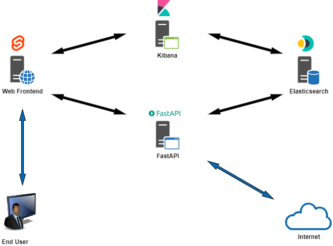
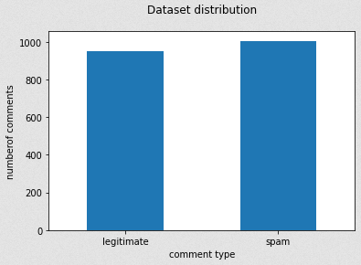
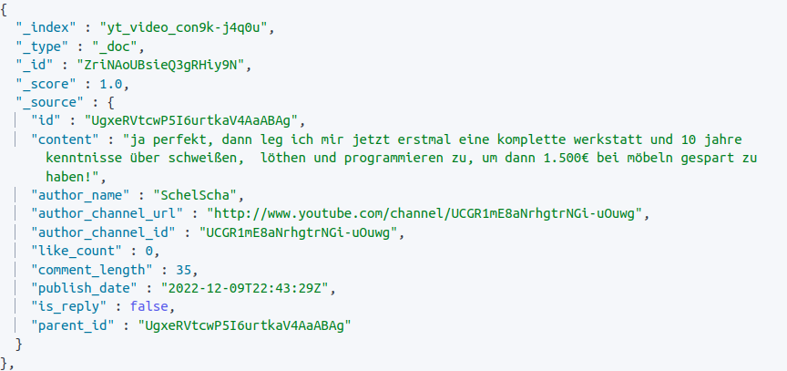
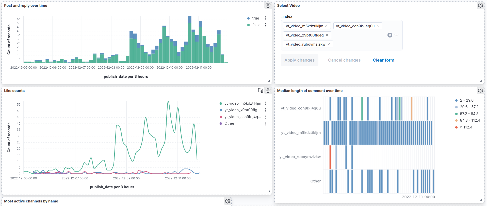
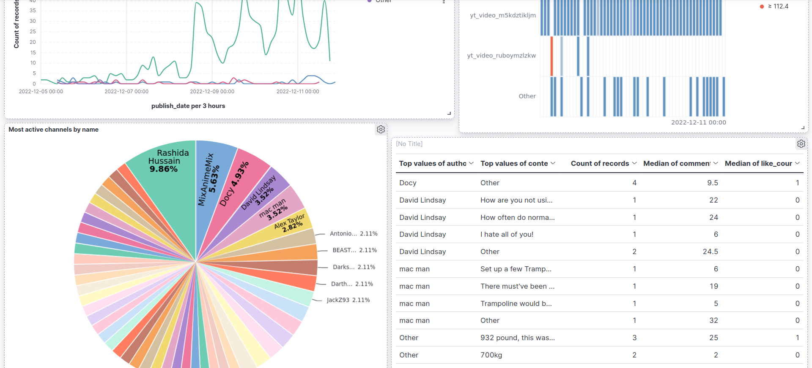

# YtSpamScanner

## Table of Contents

1. [General Information](#general-information)
1. [High Level Overview](#high-level-overview)
1. [Project State](#project-state)
1. [Data Analysis](#data-analysis)
1. [Current Code State](#current-code-state)

## General Information
Task: Text Analytics project

Team Members: Angelina Basova, Abdulghani Almasri, Paul Dietze, Vivian Kazakova

Mail Addresses: angelina.basova@stud.uni-heidelberg.de, abdulghani.almasri@stud.uni-heidelberg.de, cl250@uni-heidelberg.de, vivian.kazakova@stud.uni-heidelberg.de

Existing Code Fragments: sklearn models ([SVM](https://scikit-learn.org/stable/modules/generated/sklearn.svm.SVC.html), [Logistic Regression](https://scikit-learn.org/stable/modules/generated/sklearn.linear_model.LogisticRegression.html), [Naive Bayes](https://scikit-learn.org/stable/modules/generated/sklearn.naive_bayes.MultinomialNB.html)), [spaCy](https://spacy.io/), [nltk](https://www.nltk.org/), [YT-Spammer-Purge](https://github.com/ThioJoe/YT-Spammer-Purge)

Utilized libraries: [models-requirements](./models/requirements.txt), [middleware-requirements](./middleware/requirements.txt)

Contributions: see table below

## High Level Overview

## Project Milestones
- setup ES and Kibana, setup containers and debug configurations, obtain existing spam collection dataset ([YouTube Spam Collection Data Set](https://archive.ics.uci.edu/ml/datasets/YouTube+Spam+Collection#))
- implement pipeline for extracting video comments using YouTube Data API, implement and store models (SVM, LG, NB), implement pipeline for loading and storing data in ES, create FastAPI functions, create first (example) dashboards
- develop first prototyp of the interface
- decide on spam classifier, improve preprocessing pipeline, improve frontend by including the results of the scanning (= spam comments and embedded dashboards)
- clean and comment code
- last updates and fixes
- create video presentation and merge final code

High-level Architecture Description:

- Containers:
    - **frontend** - simple Svelte frontend that takes a video link, extracts the Video ID and shows the results (found spam comments and embedded dashboards) of the scanning
    - **middleware** - contains both an api implemented with FastAPI and main application functionality: retrieving raw data from Youtube API, reformatting, applying classifier and storing final data in Elasticsearch
    - **elasticsearch** - an ES instance
    - **kibana** - a Kibana container
    - **elasticvue** - an Elasticvue component for elasticsearch administration
    - **setup** - an additional container that runs scripts that help with configuring security credentials for ES and Kibana communication

- Code Structure in Middleware:
    - **main** - includes the api functions 
    - **data_retriever** - comprised of 4 classes
        - 2 data classes: YtComment and YtCommentReply that store comment data for initial comments and reply comments respectively 
        - 2 interface/connection classes: YtDataRetriever allows comment retrieval from the official Youtube API, ESConnect takes care of storing comments in elasticsearch
    - **classifier** - includes a Generic Classifier class (load model, load and preprocess corpus, predict comments)

- Preprocessing pipeline: removal of empty entries (and irrelevant features), lowercase, tokenization, lemmatization, removal of stop words

Data Analysis: see next section

Experiments:
 - results:
 - baselines:

## Data Analysis
Data Sources: 
 - **Reference dataset:** [YouTube Spam Collection Data Set](https://archive.ics.uci.edu/ml/datasets/YouTube+Spam+Collection#)
 - **Manually extracted dataset:** [Comments extracted using YouTube Data API](data/) (stored beforehead)
 - **User selected data**: Comments extracted using YouTube Data API (live, from the input video url)

Preprocessing:
<!--preprocessing steps - unicode normalization, length normalization, text sanitizing, etc-->
- see reference dataset description
- see DataRetriever and ESConnect classes in data_retriever.py
- see DataRetriever and ESConnect classes in data_retriever.py
 
Data Statistics: 
<!--number of samples, mean, median & standard deviation, etc.; class distribution, plots-->
- The [YouTube Spam Collection Data Set](https://archive.ics.uci.edu/ml/datasets/YouTube+Spam+Collection#) contains of 1956 comments from 5 different YouTube videos. There are 1005 spam and 951 legitimate comments. 

- The [Own Data Set](data/) contains of X comments from Y different YouTube videos. There are A spam and B legitimate comments. 
<!--Dataset with 30575 comments (spam: 12910, legitimate: 17665) was created in ./dataset.csv-->

Example comment stored in Elasticsearch: <!--example of data sample from our collection, eventually edge cases-->

 <!--TODO update-->

## Code State
- Important: Self-explanatory Variables, Comments, Docstrings, Module Structure, Code Consistency, [PEP-8](https://www.python.org/dev/peps/pep-0008/), "Hacks"

- Web App Frontend:

Default Page             |  Link entered
:-------------------------:|:-------------------------:
  |  

- Kibana Dashboards

## Contributions

Timeframe  | Angelina   | Vivian     | Abdulghani | Paul 
--------   | --------   | --------   | --------   | --------  |
10.11 - 25.11   | Accessing Youtube API  | implementation and evaluation of Support Vector Machine Classifier on the [YouTube Spam Collection Data Set](https://archive.ics.uci.edu/ml/datasets/YouTube+Spam+Collection#)     | Configuring Docker containers and compose                | Configuring ES and Kibana
26.11 - 02.12   | Sample Youtube data exploration analysis and processing | implementation and evaluation of Logistic Regression and Naive Bayes on the [YouTube Spam Collection Data Set](https://archive.ics.uci.edu/ml/datasets/YouTube+Spam+Collection#)  | Preparing and uploading the data to Elasticsearch        | Experimenting with debug configurations involving multiple containers including Svelte, FastApi, TensorFlow Serving and bare Python projects.
03.12 - 11.12   | Extending YtDataRetriever class | working on middleware and frontend | reformating ES data and working on data visualization |  working on middleware and frontend, Kibana dashboard creation

## How to run and debug?

  

  
  #### Frontend
  1. If container not already running:
  - run `docker compose up` in terminal (requires docker-compose.yml) or 
  - right-click on [docker-compose.debug.yml](docker-compose.debug.yml) in VS-Code and choose "Compose Up"

  2.  Execute launch configuration "Launch Chrome against localhost". Set breakpoints inside "frontend/src" if necessary.

  #### Middleware
  1.  If container not already running:
  - run `docker compose up` in terminal (requires docker-compose.yml) or
  - right-click on  [docker-compose.debug.yml](docker-compose.debug.yml) in VS-Code and choose "Compose Up"
  2.  Open `localhost:8000/docs` to access API. 
  3. To debug, execute launch configuration "Python: Middleware Remote Attach". Set breakpoints inside "middleware/app" if necessary.

  > **_NOTE:_** Before running `docker compose up` on Windows computer, please make sure the line ending is `LF` instead of `CRLF` in VS-Code for the file `middleware/start.sh`
  > 

  > 
  > 

